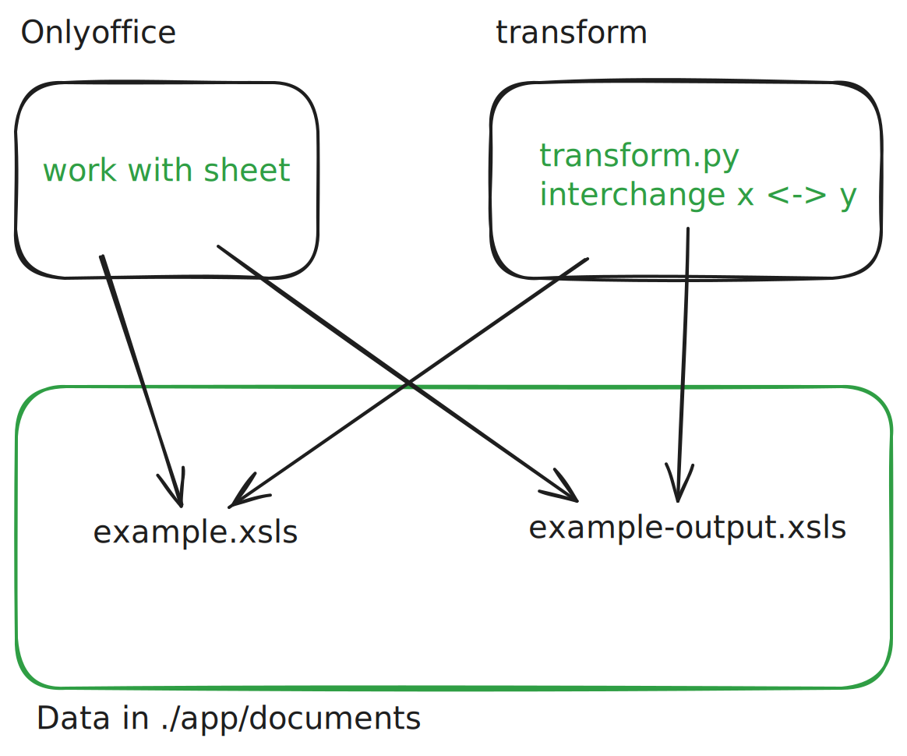

# sheet-transformation-siedecar
This is a simple example of an application of a sidecar scheme for a single node docker deployment. 
## structure
```
.
├── docker-compose.yaml
├── Dockerfile
├── documents
│   ├── example.xlsx
│   └── output_example.xlsx
├── README.md
└── transform.py   # transformation using pandas and openpyxl

```

## roles
|container|role|purpose|
|-|-|-|
|onlyoffice/desktopeditor|main container|work on documents|
|transform|sidecar|transformation: interchange x and y axis of sheet|

## diagram


## attach to transform-service
since the container is started with docker-compose it is best to attach to the service by: 

```sh
docker compose exec transform bash
```

## do the transformation
in the shell on the transform service: 
```sh
python transform.py # then provide the file
```

